  # 👋 Hi, I'm Najish Mahmud

  **Full Stack Engineer**

  [njayman.com](https://njayman.com) • [LinkedIn](https://linkedin.com/in/najishmahmud/) • [Codeberg](https://codeberg.org/njayman)

---

## 🛠️ Skills

| Category | Technologies |
|----------|-------------|
| **Languages** | TypeScript, JavaScript, Python, Go |
| **Frontend** | React, Next.js, Tailwind CSS, Socket.io, Framer Motion |
| **Backend** | NestJS, Node.js, Express, Go, FastAPI, Django, PayloadCMS |
| **Databases** | PostgreSQL, Redis, BullMQ |
| **DevOps** | Docker, Linux, Nginx, CI/CD, Coolify |
| **Cloud** | AWS |
| **Testing** | Jest, React Testing Library |

---

## 📌 Featured Projects

- [**orcchh**](https://codeberg.org/njayman/orcchh): Agentic inference routing across N configurable compute tiers (Python, PyTorch). From-scratch PPO policy with invalid-action masking, self-reporting device agents with calibration classifiers, and an OOD/entropy fallback; deployable as Docker/k8s services. Evaluated with real DistilBERT/BERT-large inference against 8 literature baselines, cutting SLA violations 3.1x under bursty traffic.
- [**nbkit**](https://nbkit.njayman.com): Convert Jupyter notebooks (.ipynb) to Markdown or plain text, no kernel required. Zero-dependency TypeScript core library, an MCP server for AI agents, and a Next.js web app.
- [**proz**](https://github.com/njayman/proz): Cross-platform CLI + TUI project launcher built with Go, Bubbletea and Cobra. Fuzzy-find and jump between projects from any terminal.
- [**Galaxy Impact**](https://github.com/njayman/galaxyimpact): Top-down bullet-heaven space shooter (C++, raylib, CMake): escalating enemy waves, skill-based leveling, shared-move-pool bosses, and a web build via Emscripten.
- [**noticable**](https://codeberg.org/njayman/noticable): My fork and rebuild of NoticeBee, Kernel International's realtime notice platform (Socket.io, React) that I maintain; NoticeBee is adopted by 100+ govt. colleges under CEDP. Adds an admin dashboard and kiosk display mode, with v2 adding offline/online status, multipart uploads, and layout management.
- [**medible**](https://codeberg.org/njayman/medible): My fork and rebuild of Medibee, Kernel International's medical student subscription platform (React/Vite/Express monorepo) that I maintain; Medibee has 1,000+ active subscribers.
- [**brain.md Skills**](https://github.com/njayman/brainmd-skills): Agent Skill/MCP plugin that teaches AI coding agents (Claude Code, Cursor, VS Code Copilot) to connect to and use brain.md, a local-first Markdown knowledge vault: auth, search, and note read/write across 16+ tools.

---

## 📊 GitHub Stats

  

   

  

---

*README auto-generated by [scripts/generate-readme.ts](scripts/generate-readme.ts) on push.*